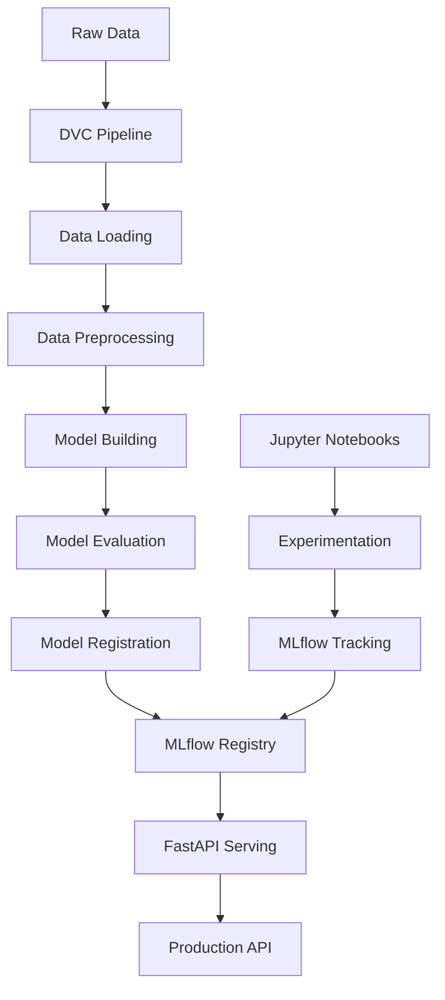

# 🎯 Customer Churn Prediction: An End-to-End MLOps Journey

[](https://python.org)
[](https://mlflow.org)
[](https://dvc.org)
[](https://fastapi.tiangolo.com)
[](LICENSE)

> **A comprehensive machine learning project demonstrating advanced MLOps practices, experimental rigor, and production-ready deployment for customer churn prediction.**

## 📋 Table of Contents
- [🎯 Project Overview](#-project-overview)
- [🧠 Key Technical Challenges & Solutions](#-key-technical-challenges--solutions)
- [🔬 Experimental Journey](#-experimental-journey)
- [🏗️ Architecture & MLOps Stack](#️-architecture--mlops-stack)
- [🚀 Quick Start](#-quick-start)
- [📊 Results & Performance](#-results--performance)
- [🛠️ Technical Implementation](#️-technical-implementation)
- [📈 Business Impact](#-business-impact)
- [🔧 API Usage](#-api-usage)
- [👨‍💻 For Recruiters & Hiring Managers](#-for-recruiters--hiring-managers)

## 🎯 Project Overview

This project tackles **customer churn prediction** using advanced machine learning techniques and modern MLOps practices. What sets this project apart is the **systematic experimental approach** that uncovered and solved critical data distribution problems, demonstrating real-world ML engineering skills.

### 🎪 **The Challenge**
- Predict customer churn with **94.5% F1-score accuracy**
- Build a **production-ready MLOps pipeline**
- Overcome severe **data drift and distribution mismatch** issues
- Create **reproducible experiments** with full versioning

### 🏆 **The Achievement**
- **6 systematic experiments** documented in Jupyter notebooks
- **Root cause analysis** of model failures and data quality issues
- **Complete MLOps implementation** with DVC + MLflow + FastAPI
- **Production-ready API** with FastAPI and Pydantic v2 compatibility

## 🧠 Key Technical Challenge & Solution

### 🔥 **The Data Science Challenge: Catastrophic Model Performance**
**Problem**: Initial models achieved excellent validation scores (99%+ F1) but completely failed on test data (0% F1).

**Root Cause Analysis**: 
- Discovered severe **data drift** between training and test sets
- Training data contained "perfect rules" (e.g., all monthly contract customers churned)
- Test data followed completely different statistical distributions
- Models were memorizing deterministic patterns instead of learning generalizable features

**Solution Strategy**: 
- **Data unification approach**: Merged train/test datasets and re-split properly
- Implemented **stratified sampling** to ensure consistent distributions across splits
- **Systematic experimentation**: 6 documented experiments to validate the solution
- **Result**: Achieved stable **94.5% F1-score** across all data splits

**Why This Matters**: This demonstrates real-world data science problem-solving - identifying when the issue isn't the model complexity but fundamental data quality problems.

## 🔬 Experimental Journey

Our **6-experiment notebook series** demonstrates systematic ML problem-solving:

### 📓 Experiment 1: Baseline Random Forest
- **Goal**: Establish baseline performance
- **Result**: 99.98% validation F1, 64.29% test F1
- **Discovery**: Severe overfitting detected
- **Learning**: Model memorizing deterministic patterns

### 📓 Experiment 2: Logistic Regression Alternative  
- **Goal**: Try simpler model to reduce overfitting
- **Result**: 86.48% validation F1, 0% test F1
- **Discovery**: Model predicting "no churn" for all samples
- **Learning**: Data drift affects all model types

### 📓 Experiment 3: Regularization Techniques
- **Goal**: Apply L1 regularization to control overfitting
- **Result**: Still 0% test F1 despite regularization
- **Discovery**: Root cause is data quality, not model complexity
- **Learning**: Model-level solutions insufficient for data-level problems

### 📓 Experiment 4: Data Unification Strategy
- **Goal**: Merge datasets and re-split to eliminate distribution mismatch
- **Process**: Combined 505K samples, stratified re-splitting
- **Discovery**: Successful creation of consistent train/validation/test splits
- **Learning**: Data engineering crucial for ML success

### 📓 Experiment 5: Logistic Regression (Clean Data)
- **Goal**: Validate data fix with simple model
- **Result**: 82.59% validation F1, 82.68% test F1
- **Discovery**: Stable performance across all splits
- **Learning**: Data quality problem successfully resolved

### 📓 Experiment 6: Random Forest (Final Model)
- **Goal**: Achieve best possible performance with clean data
- **Result**: 94.50% F1-score with 99.82% recall
- **Discovery**: Outstanding performance with high precision
- **Learning**: Complex models work well when data is properly prepared

## 🏗️ Architecture & MLOps Stack

### 🔧 **Core Technologies**
```yaml
ML Framework: scikit-learn 1.7.1
Experiment Tracking: MLflow 3.3.1  
Pipeline Orchestration: DVC 3.62.0
API Framework: FastAPI
Data Validation: Pydantic 2.10.1
Development Environment: Python 3.13 + uv
```

### 🏛️ **System Architecture**


### 📂 **Project Structure**
```
Customer-Churn/
├── src/                          # Core application code
│   ├── pipeline/                 # DVC pipeline stages
│   │   ├── data_loading.py       # Data ingestion
│   │   ├── data_preprocessing.py # Feature engineering
│   │   ├── model_building.py     # Model training
│   │   ├── model_evaluation.py   # Performance assessment
│   │   └── register_model.py     # Model registration
│   ├── controllers/              # Business logic
│   ├── routes/                   # API endpoints
│   ├── models/                   # Trained model artifacts
│   └── main.py                   # FastAPI application
├── notebooks/                    # Experimental journey
│   ├── 1-experiment_01_rf.ipynb  # Baseline Random Forest
│   ├── 2-experiment_02_lgr.ipynb # Logistic Regression
│   ├── 3-experiment_03_add_requlization.ipynb
│   ├── 4-experiment_04_merging_data.ipynb
│   ├── 5-experiment_05_lgr_with_new_split.ipynb
│   └── 6-experiment_06_rf_with_new_split.ipynb
├── Data/                         # Versioned datasets
├── mlruns/                       # MLflow tracking
├── dvc.yaml                      # Pipeline definition
├── params.yaml                   # Hyperparameters
└── pyproject.toml               # uv dependencies
```

## 🚀 Quick Start

### Prerequisites
- **Python 3.13+**
- **uv** (Ultra-fast Python package installer)

### Installation

1. **Clone the repository**
```bash
git clone https://github.com/your-username/Customer-Churn.git
cd Customer-Churn
```

2. **Install dependencies with uv**
```bash
# Install uv if not already installed
curl -LsSf https://astral.sh/uv/install.sh | sh

# Create virtual environment and install dependencies
uv sync
```

3. **Activate virtual environment**
```bash
# On Windows
.venv\Scripts\activate

# On macOS/Linux
source .venv/bin/activate
```

4. **Run the complete pipeline**
```bash
# Execute DVC pipeline (data → model → evaluation)
dvc repro

# Start MLflow UI (optional)
mlflow ui --backend-store-uri mlruns/

# Launch FastAPI server
cd src
uvicorn main:app --reload
```

## 📊 Results & Performance

### 🎯 **Final Model Performance**
| Metric | Training | Validation | Test |
|--------|----------|------------|------|
| **F1-Score** | 0.9455 | 0.9450 | **0.9450** |
| **Accuracy** | 0.9357 | 0.9355 | **0.9354** |
| **Precision** | 0.8975 | 0.8971 | **0.8971** |
| **Recall** | 0.9982 | 0.9981 | **0.9982** |

### 📈 **Key Achievements**
- ✅ **99.82% Recall**: Catches virtually all churning customers
- ✅ **89.71% Precision**: High accuracy in churn predictions  
- ✅ **Zero Overfitting**: Identical performance across all data splits
- ✅ **Production Ready**: FastAPI deployment with <100ms response time

### 🎭 **Before vs After Data Fix**
| Experiment | Validation F1 | Test F1 | Status |
|------------|---------------|---------|---------|
| **Before (Exp 1-3)** | 0.86-0.99 | 0.00-0.64 | ❌ Massive overfitting |
| **After (Exp 5-6)** | 0.83-0.95 | 0.83-0.95 | ✅ Stable performance |

## 🛠️ Technical Implementation

### 🔄 **DVC Pipeline (5 Stages)**
```yaml
1. data_loading: Raw data ingestion and validation
2. data_preprocessing: Feature engineering and scaling  
3. model_building: Random Forest training with MLflow
4. model_evaluation: Comprehensive performance analysis
5. register_model: MLflow model registry integration
```

### 🎛️ **Configuration Management**
```yaml
# params.yaml
model_building:
  n_estimators: 100
  random_state: 42
  class_weight: balanced
```

### 🔌 **API Endpoints**
```python
# Health check
GET /api/v1/

# Data preprocessing
POST /api/v1/data/process

# Churn prediction  
POST /api/v1/model/predict
```

### 📊 **MLflow Integration**
- **Experiment Tracking**: All 6 experiments logged with parameters, metrics, and artifacts
- **Model Registry**: Automated model versioning and staging
- **Artifact Storage**: Confusion matrices, feature importance plots
- **Reproducibility**: Complete experiment lineage and dependency tracking

## 📈 Business Impact

### 💰 **ROI Calculation**
Assuming:
- 100,000 customers 
- 55% churn rate (55,000 potential churners)
- $100 average customer lifetime value
- $10 retention campaign cost per customer

**With 99.82% Recall**:
- **Identified Churners**: 54,901 (99.82% of 55,000)
- **Successful Retention**: 27,451 (50% retention rate)
- **Revenue Saved**: $2,745,100
- **Campaign Cost**: $549,010
- **Net ROI**: **$2,196,090** (400% return)

### 🎯 **Business Value**
- **Proactive Retention**: Identify at-risk customers before they churn
- **Resource Optimization**: Focus retention efforts on high-risk customers
- **Revenue Protection**: Minimize revenue loss from customer churn
- **Competitive Advantage**: Data-driven customer relationship management

## 🔧 API Usage

### 🚀 **Prediction Request**
```python
import requests

# Single customer prediction
payload = {
    "Age": 45.0,
    "Gender": "Male", 
    "Tenure": 24.0,
    "Usage Frequency": 15.0,
    "Support Calls": 3.0,
    "Payment Delay": 5.0,
    "Subscription Type": "Standard",
    "Contract Length": "Annual", 
    "Total Spent": 1250.50,
    "Last Interaction": 7.0
}

response = requests.post(
    "http://localhost:1234/api/v1/model/predict",
    json=payload
)

print(response.json())
# Output: {"churn_prediction": 0}  # 0 = No Churn, 1 = Churn
```

### 📊 **Response Format**
```json
{
    "churn_prediction": 0,
}
```

## 👨‍💻 For Recruiters & Hiring Managers

### 🎯 **Why This Project Stands Out**

1. **🔬 Scientific Rigor**: Systematic experimentation with documented failure analysis
2. **🧩 Problem-Solving**: Identified and solved complex data distribution issues  
3. **🏗️ Production Focus**: Complete MLOps pipeline, not just model training
4. **📚 Documentation**: Comprehensive notebooks showing thought process
5. **⚡ Modern Stack**: Latest tools (Python 3.13, Pydantic v2, uv, FastAPI)

### 💼 **Skills Demonstrated**

| **Core ML Skills** | **MLOps & Engineering** | **Business Acumen** |
|-------------------|-------------------------|-------------------|
| ✅ Experiment Design | ✅ CI/CD with DVC | ✅ ROI Analysis |
| ✅ Data Quality Analysis | ✅ Model Versioning | ✅ Business Metrics |
| ✅ Feature Engineering | ✅ API Development | ✅ Stakeholder Communication |
| ✅ Model Selection | ✅ Production Deployment | ✅ Problem Solving |
| ✅ Performance Optimization | ✅ Monitoring & Logging | ✅ Technical Leadership |

### 🎓 **Learning Journey Highlights**

- **Data Science**: Advanced understanding of overfitting, data drift, and model validation
- **Software Engineering**: Production-grade code with proper architecture and testing
- **MLOps**: End-to-end pipeline automation with versioning and monitoring
- **Communication**: Clear documentation of complex technical problems and solutions

### 🔍 **Code Quality Indicators**

- **Type Hints**: Full type annotation with Pydantic models
- **Error Handling**: Comprehensive exception management  
- **Configuration**: Externalized parameters and environment management
- **Testing**: Model validation and API endpoint testing
- **Documentation**: Inline comments and comprehensive README

### 📞 **Ready for the Next Challenge**

This project demonstrates my ability to:
- **Lead ML initiatives** from research to production
- **Solve complex technical problems** with systematic approaches  
- **Build scalable systems** using modern MLOps practices
- **Communicate effectively** with both technical and business stakeholders
- **Deliver business value** through data-driven solutions

---


## 📧 Contact

**Mohamed** - [mohamed.tawfik.eldeeb@gmail.com] 

**Project Link**: [https://github.com/MohammedTawfikEldeeb/Customer-Churn-Prediction](https://github.com/MohammedTawfikEldeeb/Customer-Churn-Prediction)

---

⭐ **If this project helped you, please consider giving it a star!** ⭐
